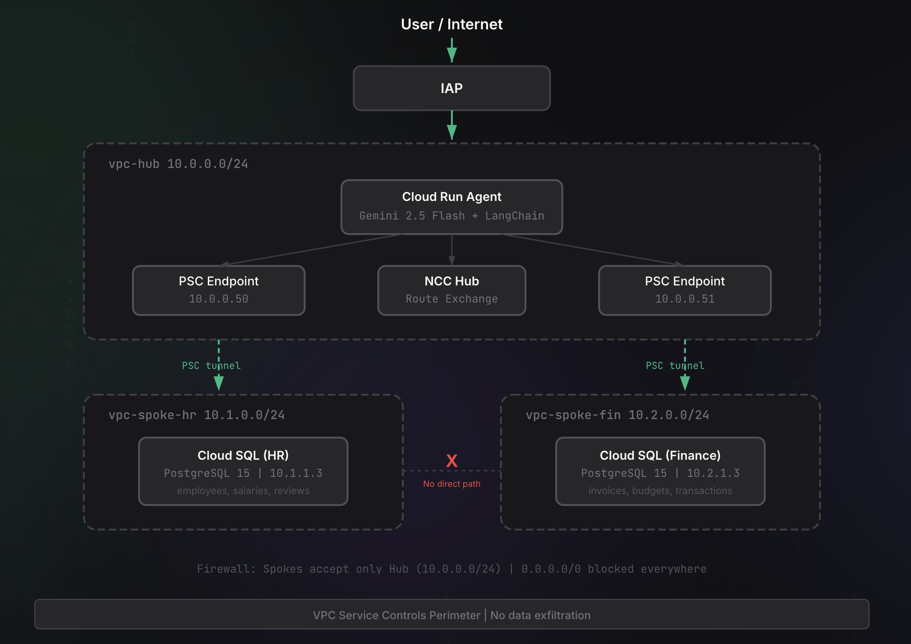

# VIP Data Concierge

A Zero-Trust AI Agent that routes queries to isolated databases based on user identity. Built on GCP with Hub-and-Spoke networking, Private Service Connect, and Vertex AI.

[](https://youtu.be/3ATSpNSdtiw)

## Architecture



### Key Components

| Component | Purpose |
|-----------|---------|
| **NCC Hub** | Routes traffic between VPCs without peering mesh |
| **PSC Endpoints** | Agent uses Hub-local IPs to reach spoke databases |
| **Private Google Access** | Vertex AI calls stay on Google's backbone |
| **VPC-SC Perimeter** | Prevents data exfiltration outside the project |
| **IAP** | Zero-trust entry, identity determines access |

## How It Works

1. User sends a question via HTTPS to Cloud Run in the Hub VPC
2. IAP verifies identity, attaches email and department claim
3. Agent resolves department (HR or Finance) from identity
4. Gemini picks a tool via Function Calling based on the question
5. Tool queries the correct database through PSC endpoint
6. Gemini formats the final answer from tool results

### Data Isolation

- **HR users** only get HR tools, which only connect to `10.0.0.50` (HR database)
- **Finance users** only get Finance tools, which only connect to `10.0.0.51` (Finance database)
- **Unknown users** are rejected with 401 before any tool is loaded
- Spokes cannot communicate with each other directly

## Tech Stack

| Layer | Technology |
|-------|-----------|
| Orchestration | Google Cloud NCC |
| Compute | Cloud Run (serverless) |
| Database | Cloud SQL PostgreSQL 15 (private IP only) |
| AI Model | Vertex AI Gemini 2.5 Flash |
| Framework | LangChain + Function Calling |
| Security | IAP, VPC-SC, PSC, IAM |
| CI/CD | GitHub Actions + Workload Identity Federation |

## Project Structure

```
├── app.py              # Flask server, extracts identity, routes to agent
├── agent.py            # Gemini agent with Function Calling loop
├── tools.py            # LangChain tools (HR tools + Finance tools)
├── db.py               # Database access layer via PSC endpoints
├── config.py           # Environment-based configuration
├── Dockerfile          # Container image for Cloud Run
├── requirements.txt    # Python dependencies
├── .env.example        # Environment variable template
└── .github/workflows/
    └── deploy.yml      # CI/CD pipeline with WIF auth
```

## Setup

### Prerequisites

- GCP project with billing enabled
- APIs enabled: Compute, NCC, SQL Admin, Vertex AI, Cloud Run, VPC Access, Service Networking, IAP

### Environment Variables

Copy `.env.example` to `.env` and fill in the values:

```bash
cp .env.example .env
```

### Deploy

Push to `master` triggers the GitHub Actions pipeline which:

1. Builds the Docker image
2. Pushes to Artifact Registry
3. Deploys to Cloud Run with VPC connector

## Firewall Rules

| From / To | Hub | HR | Fin | Internet |
|------------|:---:|:--:|:---:|:--------:|
| Hub        | - | ✅ | ✅ | ❌ |
| HR         | ✅ | - | ❌ | ❌ |
| Fin        | ✅ | ❌ | - | ❌ |
| Internet   | ❌ | ❌ | ❌ | - |

## License

MIT
